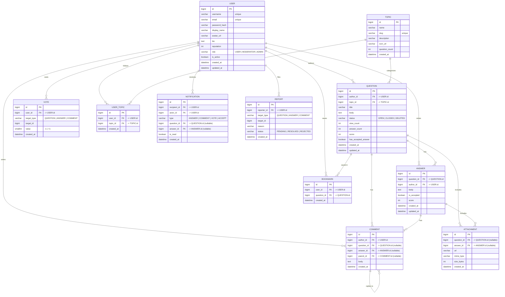

# EngQA

EngQA is an English-language discussion forum (a Reddit-style Q&A app) where learners
post questions, the community answers them, and answers can be voted, commented on and
accepted. This repository contains the native Android client.

## Tech stack

| Layer     | Choice                                                        |
|-----------|---------------------------------------------------------------|
| Language  | Java 11                                                       |
| UI        | XML layouts, `ConstraintLayout`, `LinearLayout`, Material 3   |
| Build     | Gradle (Kotlin DSL) `compileSdk 37`, `minSdk 29`              |
| Theme     | Dark-only (`Theme.Material3.Dark.NoActionBar`)                |

## Repository setup

Clone the project into `E:/` (Windows) or any local folder:

```bash
git clone https://github.com/Ddawng18/MOB-EngQA E:/MOB-EngQA
cd E:/MOB-EngQA
```

Open the folder in Android Studio, let Gradle sync, then run the `app` configuration
on a device/emulator. From the command line:

```bash
./gradlew assembleDebug          # build the APK
./gradlew installDebug           # install on a connected device
```

## Database design (ERD)

The client is a forum, so the backend data model is built around **users**, **questions**,
**answers** and **topics**, with supporting tables for votes, comments, bookmarks,
attachments, notifications and reports. A **question** (post) is authored by one user and
belongs to one topic; it fans out to many **answers**; answers and questions can both
receive **comments** and **attachments**. **Votes** and **reports** are polymorphic
(`target_type` + `target_id`) so a single table covers questions, answers and comments.



### Keys and constraints

- `USER.username`, `USER.email` and `TOPIC.slug` are unique.
- `QUESTION.author_id`, `ANSWER.author_id`, `COMMENT.author_id` → `USER.id`.
- `ANSWER (question_id, author_id)` and `VOTE (user_id, target_type, target_id)` are unique
  (one vote per user per target; an author cannot vote twice).
- `COMMENT` carries exactly one of `question_id`/`answer_id` (check constraint) and an
  optional `parent_id` for threaded replies.
- `ATTACHMENT` carries exactly one of `question_id`/`answer_id` (check constraint).
- `VOTE.target_id` and `REPORT.target_id` reference the row selected by `target_type`
  (polymorphic FK, enforced in the application layer or with a trigger), so they have no
  hard foreign-key line in the diagram.

### How to embed the ERD in `README.md`

1. Paste the ` ```mermaid ... ``` ` block above directly into `README.md`.
   GitHub, GitLab and Azure DevOps render Mermaid natively, so the diagram appears
   inline with no extra tooling.
2. To keep the diagram in a separate file, save it as `docs/erd.mmd` and reference it with
   an image link that uses GitHub's Mermaid proxy, for example:

   ```markdown
   
   ```

   Generate the base64 payload with `base64 -w0 docs/erd.mmd`.
3. For a static image in local editors or PDFs, install the CLI and export:

   ```bash
   npm install -g @mermaid-js/mermaid-cli
   mmdc -i docs/erd.mmd -o docs/erd.png
   ```

   Then embed the bitmap: ``.
4. In VS Code, the "Markdown Preview Mermaid Support" extension renders the same block
   in the preview pane, and the "Mermaid Markdown Syntax Highlighting" extension
   highlights it in the editor.

## Screens

| Screen                          | Layout                          | Activity                |
|---------------------------------|---------------------------------|-------------------------|
| Home / question feed            | `activity_home.xml`             | `HomeActivity`          |
| Ask a question / login          | `activity_main.xml`             | `MainActivity`          |
| Question detail                 | `activity_question_detail.xml`  | `QuestionDetailActivity`|
| Can't connect to the server     | `activity_server_error.xml`     | `ServerErrorActivity`   |

The "Can't connect to the server" screen is a pixel-accurate rebuild of the Figma
prototype: `#0E1113` screen background, `#1A1A1B` app bars, a 277dp illustration, the
18sp/13sp headline and error code, and the home/ask/profile navigation bar.
